<table width="100%" border='0'>
 <tr><td width="40%" valign="bottom"></td><td valign="middle">
 <h2>Пример организации автотестирования сайта <a target="_blank" href="https://www.demoqa.com/">www.demoqa.com</a></h2>
 </td></tr>
</table>

### *Проект создан в рамках прохождения курса  школы QA GURU "Автоматизация тестирования на Python"*

## :open_book: Содержание:
- [Описание проекта](#heavy_check_mark-описание)
- [Технологии и инструменты](#gear-технологии-и-инструменты)
- [Реализованные проверки](#ballot_box_with_check-реализованные-проверки)
- [Запуск тестов в Jenkins](#-как-запускать-тесты)
- [Allure отчет](#-allure-отчет-о-прохождении-тестов)
- [Видео прохождения тестов](#movie_camera-примеры-видео-прохождения-тестов)
- [Уведомления в Telegram](#-уведомление-в-telegram)
- [Интеграция с Allure TestOps](-интеграция-с-allure-testops)
  
## :heavy_check_mark: Описание:
> - Демо проект по автоматизации тестирования UI сайта <a target="_blank" href="https://demoqa.com/"> demoqa.com<a>
> - Проект создан в рамках обучения на курсе <a target="_blank" href="https://qa.guru/python"> QA GURU Автоматизация тестирования на Python</a>
> - Тесты написаны на языке <code>Python</code> с помощью библиотеки <code>Selene</code>
> - Запуск тестов осуществляется в <code>Jenkins</code> с вариантами выбора браузера и его версии
> - Браузеры запускаются в <code>Docker</code> контейнере с помощью <code>Selenoid</code>
> - По результатам тестов формируется <code>Allure</code> отчет с вложениями (скриншоты, логи, видео прохождения теста)
> - Отправляется уведомление о результатах прохождения тестов в <code>Telegram</code> 
> - Реализована интеграция с <code>AllureTestOps</code> и <code>Jira</code> 
## :gear: Технологии и инструменты:

  &nbsp;
  &nbsp;
  &nbsp;
  &nbsp;
  &nbsp;
  &nbsp;
  &nbsp;
  &nbsp;
  &nbsp;
  &nbsp;
  &nbsp;

## :ballot_box_with_check: Реализованные проверки:
- [x] Отправка формы и проверка данных всей заполненной формы
- [x] Отправка формы и проверка данных только с заполнением основных полей
- [x] Открытие второй вкладки в браузере
- [x] Проверка всплывающей подсказки в текстовом поле
- [x] Проверка всплывающего окна оповещения
- [x] Проверка всплывающего окна оповещения с вводом текста

##  Как запускать тесты:
<h3>Тесты запускаются в <a target="_blank" href="https://jenkins.autotests.cloud/job/demo_qa_ui/"> Jenkins.</a></h3>

1. Нажать кнопку Собрать с параметрами (Build with parameters)
  
  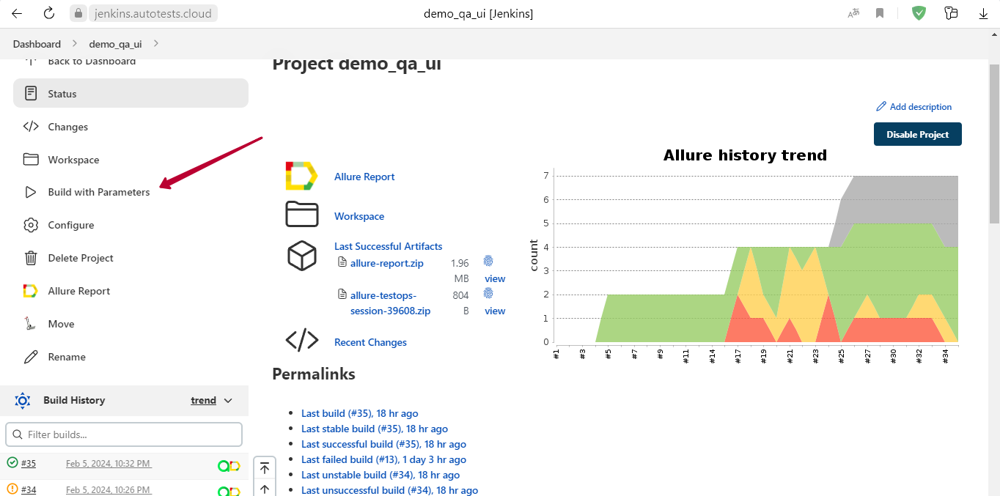
  
2. Выбрать параметры Браузер на котором будут запускаться тесты и версию этого браузера и нажать Собрать (Build)
   
  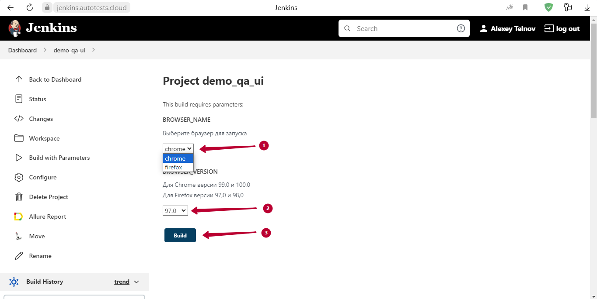
     

##  Allure отчет о прохождении тестов

Пример отчета по ссылке <a target="_blank" href="https://jenkins.autotests.cloud/job/demo_qa_ui/allure/"> https://jenkins.autotests.cloud/job/demo_qa_ui/allure/</a>
> Для перехода в отчет из Jenkins иконки 1 или 2 на скрине

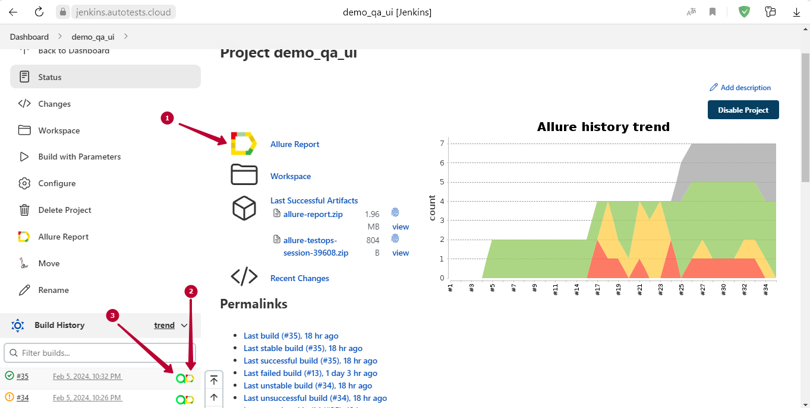

###### Главный экран (Overview)
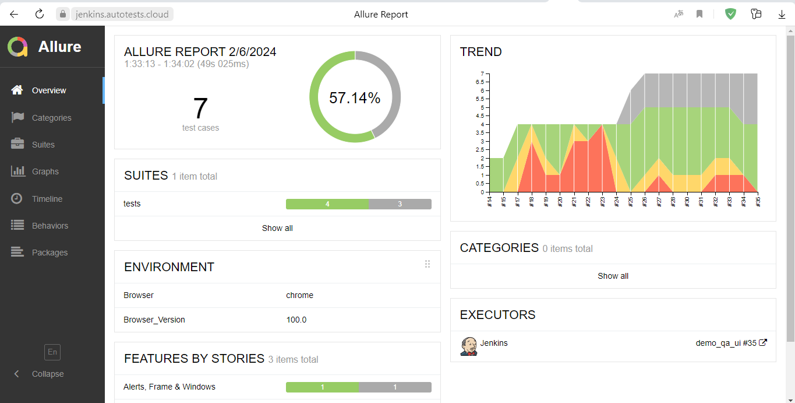

*Главная страница Allure-отчета содержит следующие информационные блоки:*

> - [x] <code><strong>*ALLURE REPORT*</strong></code> - отображается дату и время прохождения теста, общее количество тест кейсов, а также диаграмма с указанием процента и количества успешных, упавших и сломавшихся в процессе выполнения тестов
>- [x] <code><strong>*TREND*</strong></code> - отображает тренд прохождения тестов от сборки к сборке
>- [x] <code><strong>*SUITES*</strong></code> - отображает распределение результатов тестов по тестовым наборам
>- [x] <code><strong>*CATEGORIES*</strong></code> - отображает распределение неуспешно прошедших тестов по видам дефектов
>- [x] <code><strong>*ENVIRONMENT*</strong></code> - отображает тестовое окружение, на котором запускались тесты 
>- [x] <code><strong>*FEATURES BY STORIES*</strong></code> - отображает распределение тестов по функционалу, который они проверяют

<strong>Пример описания шагов теста</strong>

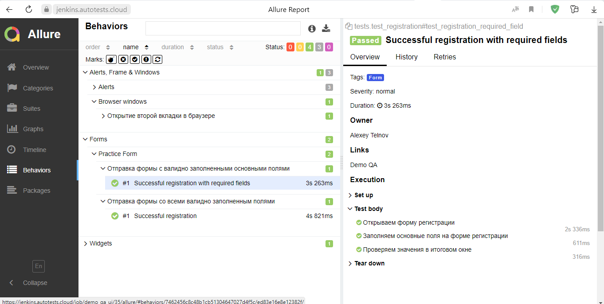

 

<strong>Пример описания шагов теста c подшагами</strong>

 
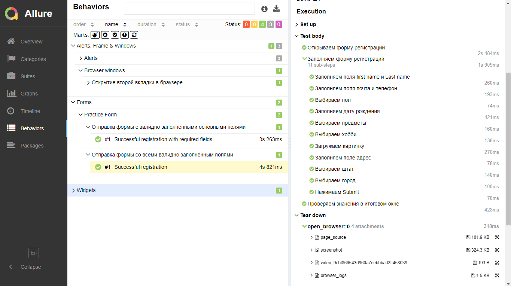

 

<strong>Вложения для каждого теста: Page sourse, Скриншот, Видео прохождения, Лог.</strong>

 
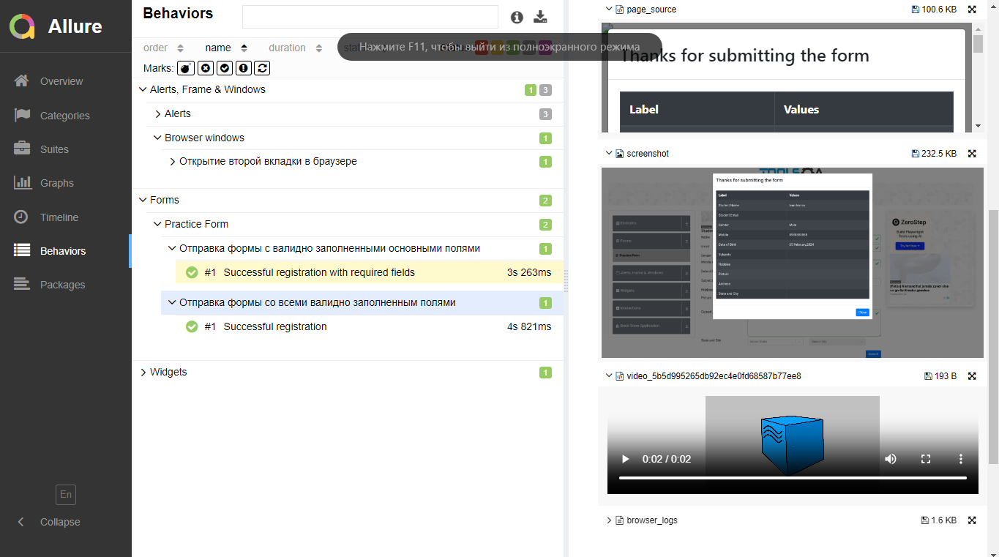

## :movie_camera: Примеры видео прохождения тестов:

<strong>Отправка формы и проверка данных только с заполнением основных полей</strong>

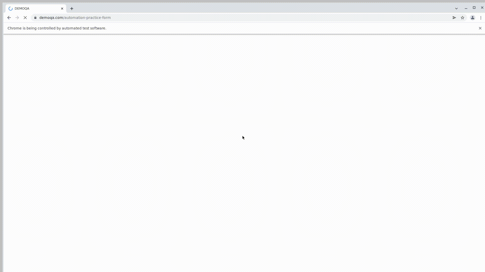

<strong>Проверка всплывающей подсказки в текстовом поле</strong>

 
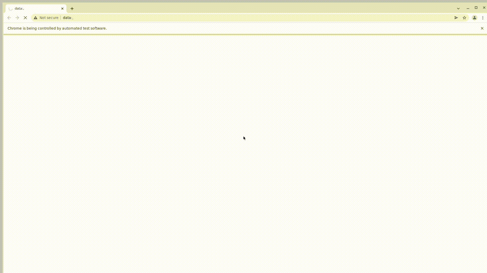

##  Уведомление в telegram

После прохождения тестов в телеграмм канал бот присылает уведомление с краткой информацией и ссылкой на отчет. Так же можно добавить уведомления на почту, в `Discord`, `Slack` и другие мессенджеры

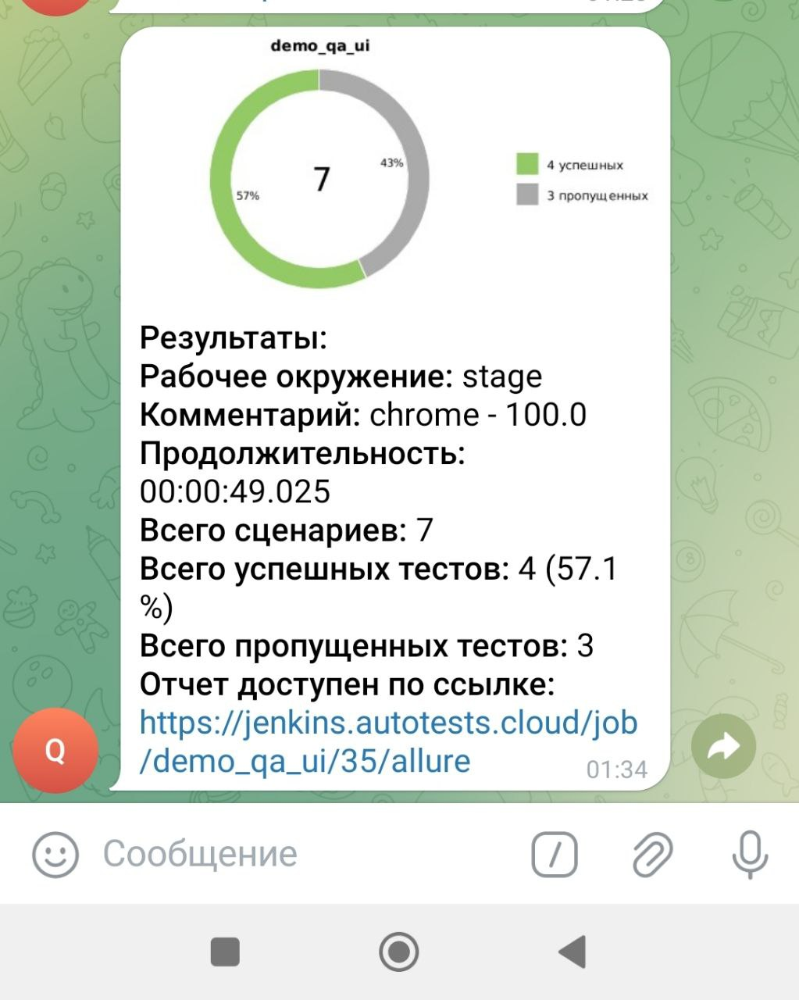

###  Интеграция с Allure TestOps
### [Dashboard](https://allure.autotests.cloud/project/4025/dashboards)
Для перехода из Jenkins нажать 3

Все данные о запусках тестов также хранятся в Allure TestOps
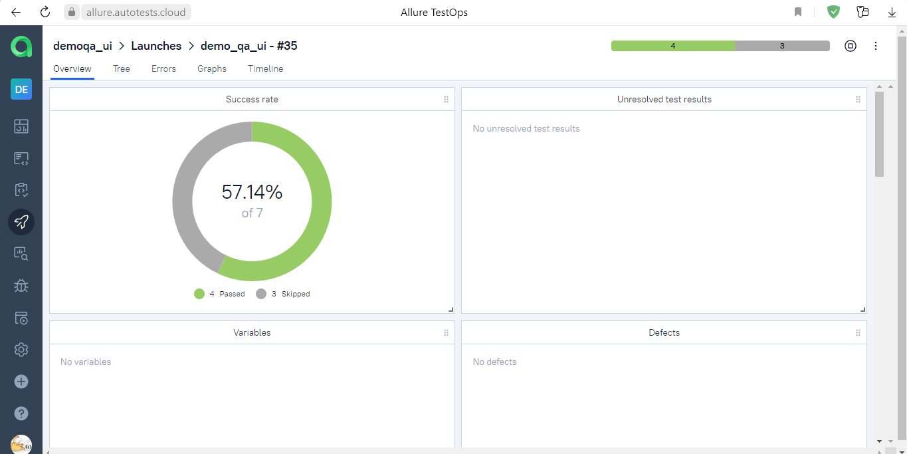

> 

<strong>TestOps автоматически формирует тест кейсы на основе результатов прохождения тестов</strong>

>
>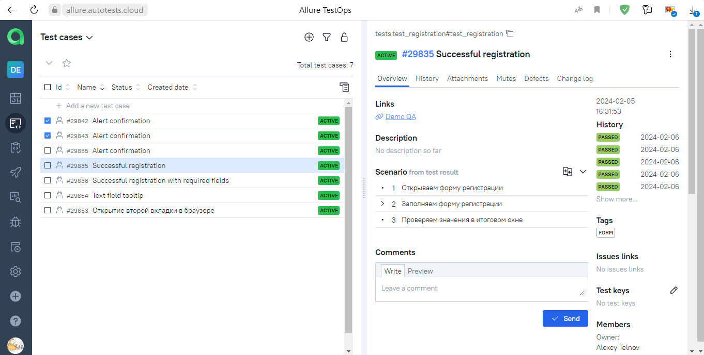
>

>
>

<strong>Можно фильтровать тесты и запускать их выборочно непосредственно из TestOps</strong>

>
>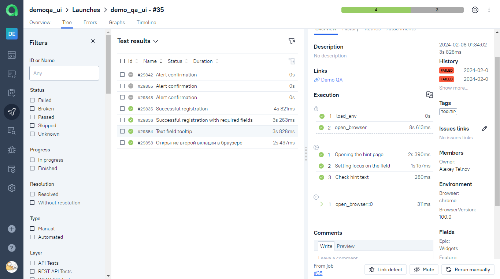
>

>
> - Можно создавать ручные тест кейсы и импортировать их в IDE с помощью плагина
> - Результаты тестирования отображаются в реальном времени во время прохождения теста
> - Можно настроить интеграцию с `Jira`

